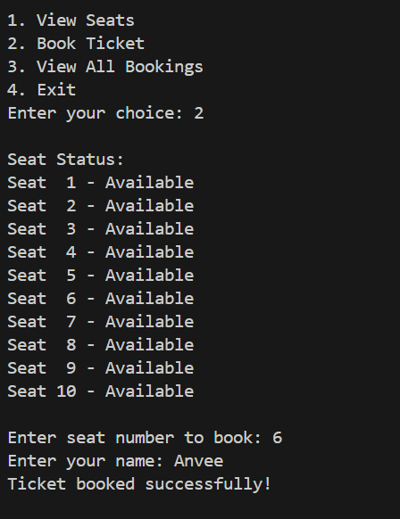
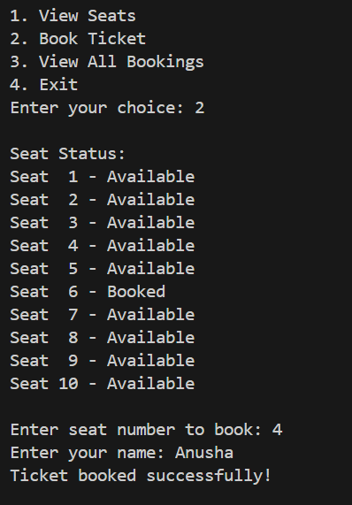

# 🎟 Movie Ticket Booking System (C++)

## 📖 Overview

The _Movie Ticket Booking System_ is a simple console-based C++ application that allows users to view seat availability, book tickets, and view all previous bookings.  
It uses _Object-Oriented Programming_ and _file handling_ to store booking details permanently, providing a smooth, real-world booking experience in the terminal.

---

## ⚙ Features

- 🎬 _View Seats:_ Shows all available and booked seats.
- 💺 _Book Tickets:_ Lets users select a seat and confirm booking.
- 💰 _Dynamic Pricing:_ Increases price based on seat number.
- 🧾 _Save Bookings:_ All details stored in bookings.txt.
- 📂 _View History:_ Displays all user bookings from the file.

---

## 🧠 Technologies Used

- _Language:_ C++
- _Concepts:_ Classes, File Handling, Loops, Conditionals
- _Tools:_ VS Code / GCC Compiler

---

## 🚀 How to Run

1. Clone or download this repository.
2. Open in _VS Code_ (or any C++ IDE).
3. Compile and run:

   ```bash
   g++ main.cpp -o ticket
   ./ticket

   ```

4. Interact using the console menu.

💡 Example Output

🎟 Movie Ticket Booking System 🎟

1. View Seats
2. Book Ticket
3. View All Bookings
4. Exit
   Enter your choice: 2
   Enter seat number to book: 4
   Enter your name: Anusha
   Ticket booked successfully!

---

File output (bookings.txt):
Name: Anusha, Seat: 4, Price: 190

---

## 📸 Screenshots

### 🎬 App Console View

Here’s how the app looks when you run it in the terminal:



---

### 🧾 Booking Confirmation Output

This shows the output after booking a seat successfully:



🌟 FUTURE ENHANCEMENTS 🌟

GUI version using Qt or web interface

Multi-movie selection

Online payment simulation

Admin panel for managing all bookings

---

🏆 Project Author

Anusha
🔗 GitHub: [https://github.com/MrsRathode/Ticket-Booking-System.git]
